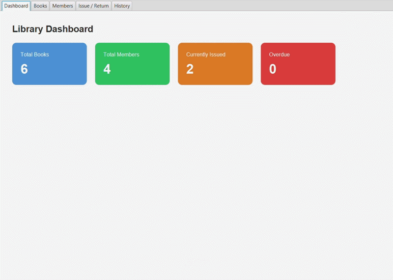
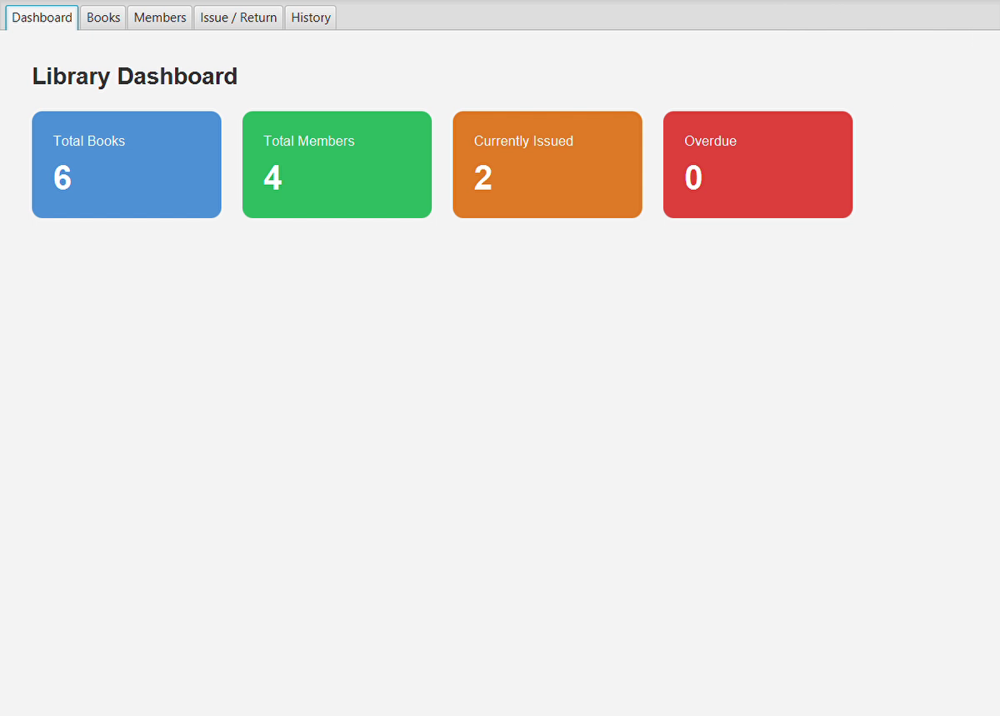
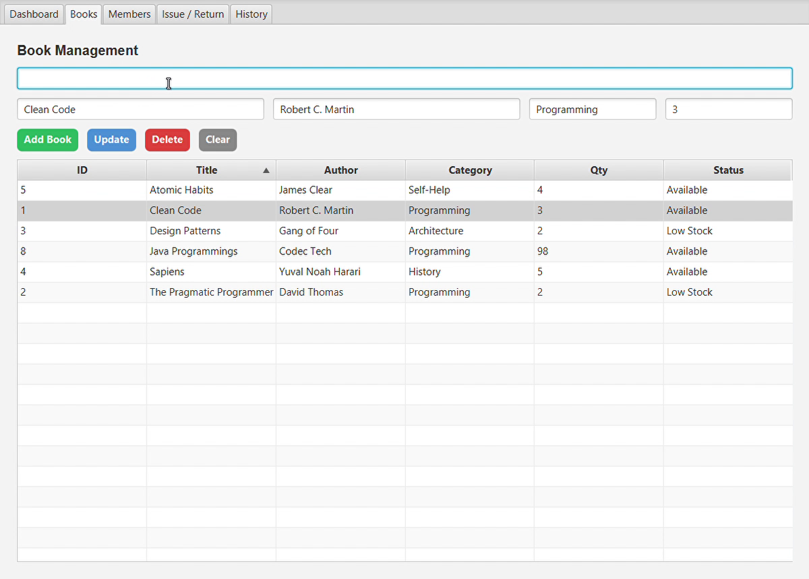
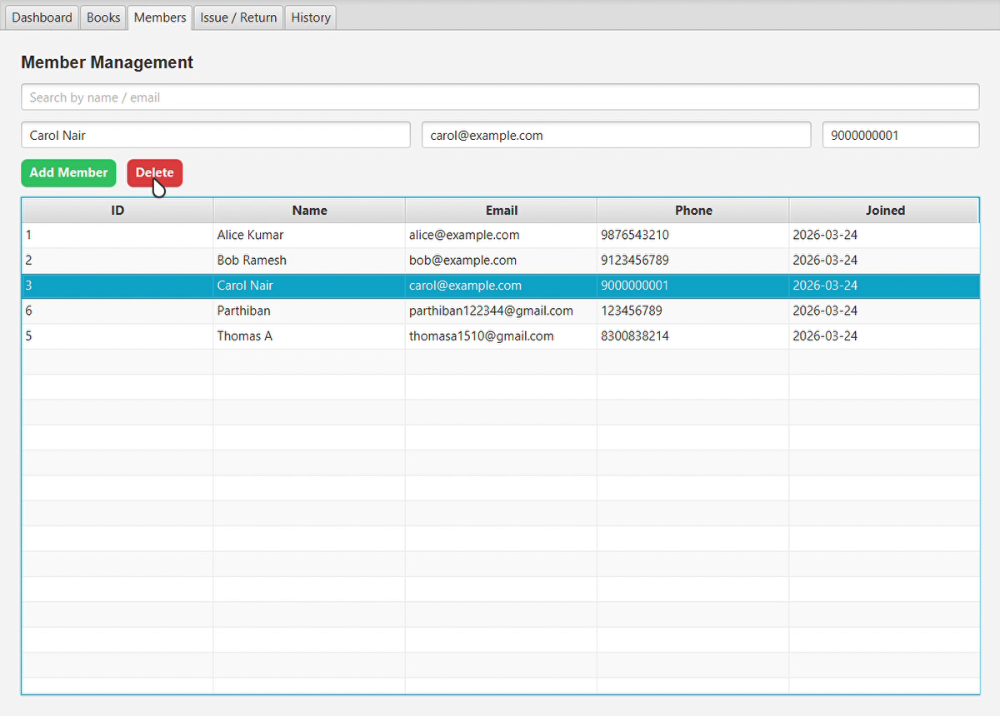
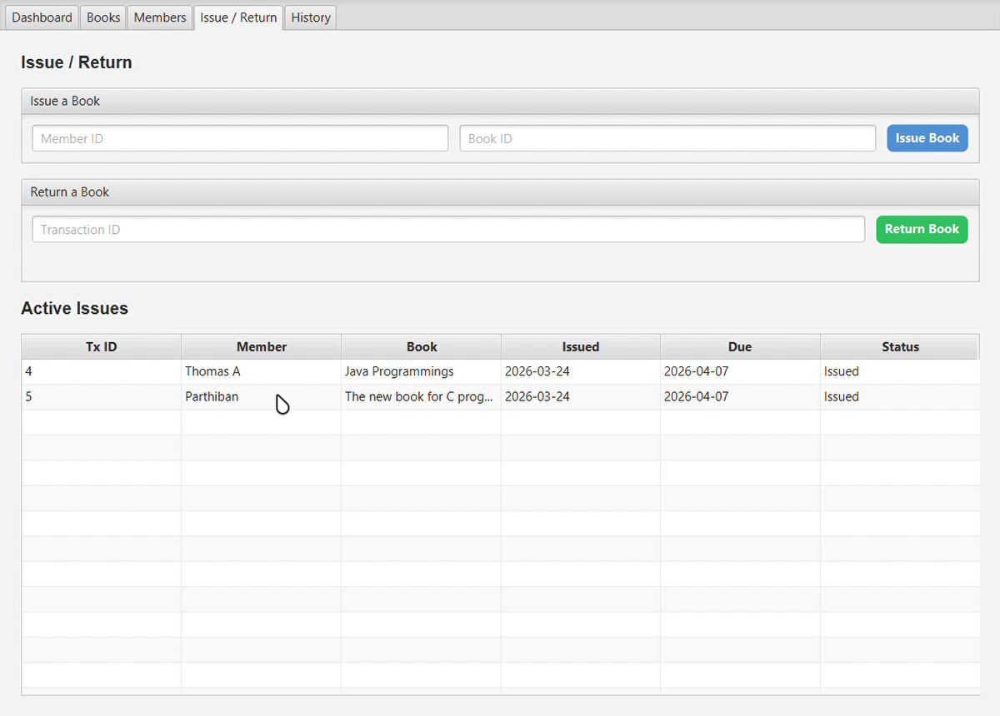
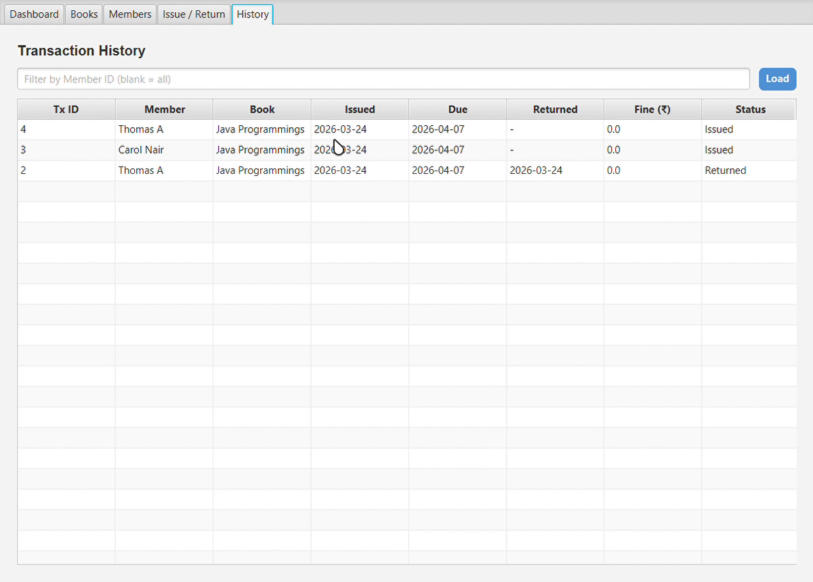

# 📚 Library Management System

> Manage books like a pro 📖✨ — because every smart library deserves a smart system 😎

A modern and beginner-friendly **Library Management System** built using **JavaFX, JDBC, and MySQL**.  
This project was developed as part of my **internship at Codec Technologies** to strengthen my practical skills in **Java desktop application development, database connectivity, and software design**. 🚀

---

## ✨ Features

- 📖 **Book Management**
  - Add new books
  - Update existing book details
  - Delete books
  - Track book quantity in real time

- 👤 **Member Management**
  - Add and manage library members
  - View member records easily

- 🔄 **Issue / Return System**
  - Issue books to members
  - Return books using transaction ID
  - Automatic stock update after issue/return

- ⏰ **Due Date & Fine Calculation**
  - Auto due date generation
  - Overdue fine calculation
  - Fine status display on return

- 📊 **Dashboard**
  - Total books
  - Total members
  - Active issued books
  - Overdue books count

- 🕘 **History Tracking**
  - View issued and returned book records
  - Track library activity efficiently

- 🔁 **Real-Time Refresh**
  - Book quantity refreshes after issue/return

---

## 🛠️ Tech Stack

- **Java** ☕
- **JavaFX** 🎨
- **JDBC** 🔌
- **MySQL** 🗄️
- **Eclipse IDE** 💻

---

## 🎯 Internship Project

This project was created during my **internship at Codec Technologies** as a practical desktop-based library management solution.  
It helped me gain hands-on experience in:

- Java application development
- JavaFX UI design
- MySQL database integration
- JDBC connectivity
- Real-world CRUD + transaction handling

---

## 📂 Project Structure

- `Main.java` → Main JavaFX application & UI flow
- `BookDAO.java` → Book database operations
- `MemberDAO.java` → Member database operations
- `TransactionDAO.java` → Issue, return, due date, and fine logic
- `DBConnection.java` → MySQL database connection
- `model/` → Entity classes like Book, Member, Transaction

---

## 🧠 How It Works

1. Add books to the inventory 📚  
2. Add members to the system 👥  
3. Issue a book using **Member ID** and **Book ID** 🔄  
4. Quantity decreases automatically 📉  
5. Return a book using **Transaction ID** ↩️  
6. Quantity increases automatically 📈  
7. If returned late, overdue fine is calculated automatically 💸  

---

## 🗃️ Database Tables

This project uses **MySQL** with the following main tables:

- `books`
- `members`
- `transactions`

---

## ▶️ How to Run

1. Clone this repository
2. Open the project in **Eclipse IDE**
3. Configure **JavaFX** library in build path
4. Set up your **MySQL** database
5. Update DB credentials in `DBConnection.java`
6. Run `Main.java`

---

## 🎥 Project Demo

### 📺 YouTube Demo
[▶️ Watch Full Demo on YouTube](https://youtu.be/beowWgWT_C4?si=1qBoWG1yuvpDRXjY)

### 🎞️ GIF Preview

---

## 📸 Project Outputs

### 1️⃣ Dashboard / Home

### 2️⃣ Books Management

### 3️⃣ Members Management

### 4️⃣ Issue / Return System

### 5️⃣ History / Final Output

---

## 🌟 Why This Project is Special

This is not just a basic CRUD project 😎  
It includes:

- Real-world library workflow
- Member & book management
- Transaction handling
- Due date logic
- Fine calculation
- Dashboard analytics
- Real-time quantity updates

Perfect for:

- 🎓 College mini project
- 🎓 Final year project
- 💼 Resume / portfolio
- 👨‍💻 Java practice
- 🎤 Interview explanation

---

## 🙌 Author

**Thomas A**  
Built with patience, debugging, coffee, and determination ☕🔥

---

## ⭐ Support

If you like this project, give it a **star** ⭐  
It will make this little library very happy 📚😄

---

## 📜 License

This project is for **learning, educational, and portfolio purposes**.
